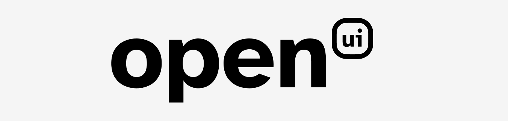

# Welcome! 👋
**OpenUI** is a developer friendly Rust library for creating high-performance cross-platform GUI apps. This is a great choice for anyone who doesn't want to work directly with [OpenGL](https://www.khronos.org/opengl/wiki/OpenGL_Shading_Language), or wrappers like [Glutin](https://crates.io/crates/glutin) or [Glium](https://crates.io/crates/glium), and for anyone who doesn't need an entire desktop web framework like [Electron](https://github.com/electron/electron) or [Tauri](https://github.com/tauri-apps/tauri). 


# Try It Yourself! 🕹
It's extremely easy to try out the OpenUI example project, a 1980's-style [Snake Game](https://en.wikipedia.org/wiki/Snake_(video_game_genre)#History). Use the arrow keys and spacebar to play.

```sh
git clone git@github.com:craigfay/open_ui.git && cd open_ui
cargo run
```

# Developer Installation 💽
Add OpenUI as a dependency in any Cargo project:

```toml
# Cargo.toml
[dependencies]
open_ui = "*"
```

# Build Your Own App with OpenUI 🧱
To create a Rust program that renders a UI, simply define a struct that implements the `UIController` interface:

```rust
use open_ui::UIController;

// Define a struct to hold your application data
struct SnakeGame {};


// Implement the `UIController` interface to define application behavior
impl UIController for SnakeGame {

    fn blueprint(&self) -> UIBlueprint {
        // This function wil be called once before the application opens,
        // and determines the initial settings of the rendering window.
    }

    fn next_frame(&mut self) -> Option<&RgbaImage> {
        // This function will be called called every frame,
        // and returns the contents of the next render-able frame,
        // or `None` if the application should terminate.
    }

    fn process_events(&mut self, events: &Vec<UIEvent>) {
        // This function will be called every frame, receiving
        // input events, and usually responding by modifying state.
    }
}
```

Then, pass an instance of that struct into `UI::launch()`:

```rust
use open_ui::UI;

fn main() {
    let application = SnakeGame::new();
    UI::launch(application);
}
```

# Resources 📖
- [example project](/src/main.rs)
- [documentation](https://docs.rs/open_ui/latest/open_ui/index.html)
- [crates.io page](https://crates.io/crates/open_ui)
